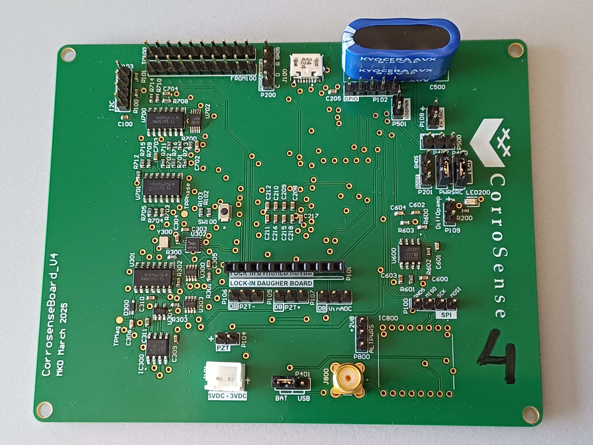

# CorroSenseBoardV4

This repository contains documentation, Altium design files, and software for the **CorroSenseBoardV4**.

## Jumpers on PCB

Several jumpers must be configured correctly for the board to function as intended. The jumpers are explained below, grouped by the board type.

---

### Motherboard

- **P400 (Pin 2 ↔ Pin 3):**  
  Selects the power source as internal (USB/BAT) instead of energy harvesting.

- **P401 (Pin 1 ↔ Pin 2):**  
  Selects the battery as the power source instead of USB.

- **P402 (Pin 2 ↔ Pin 3):**  
  Selects the power source as internal (USB/BAT) instead of energy harvesting.

---

The board can then be powered on J101 with max 5VDC and min 3VDC.

### Daughterboard

*(Add relevant jumper details here if available)*

